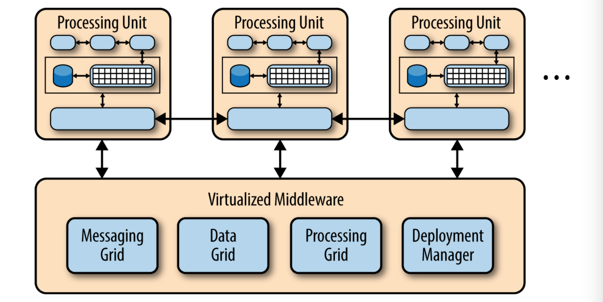
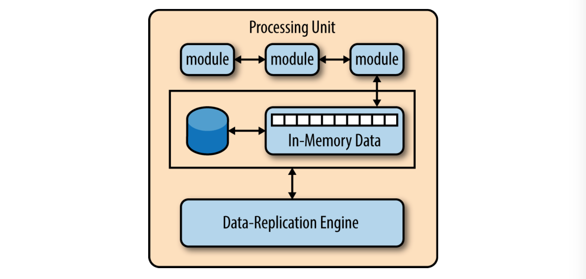
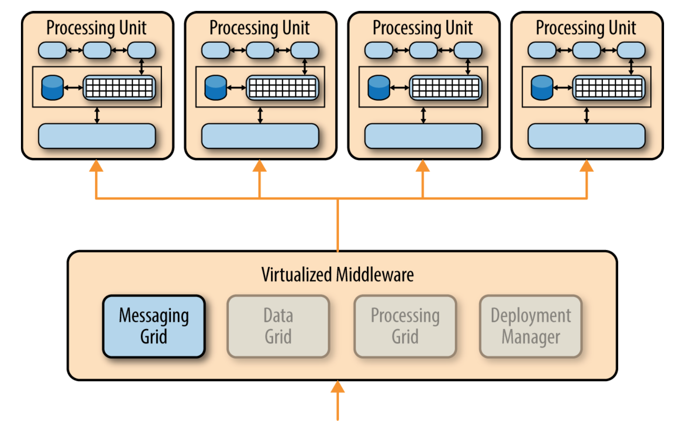
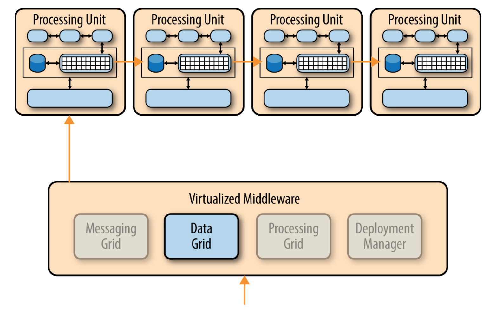
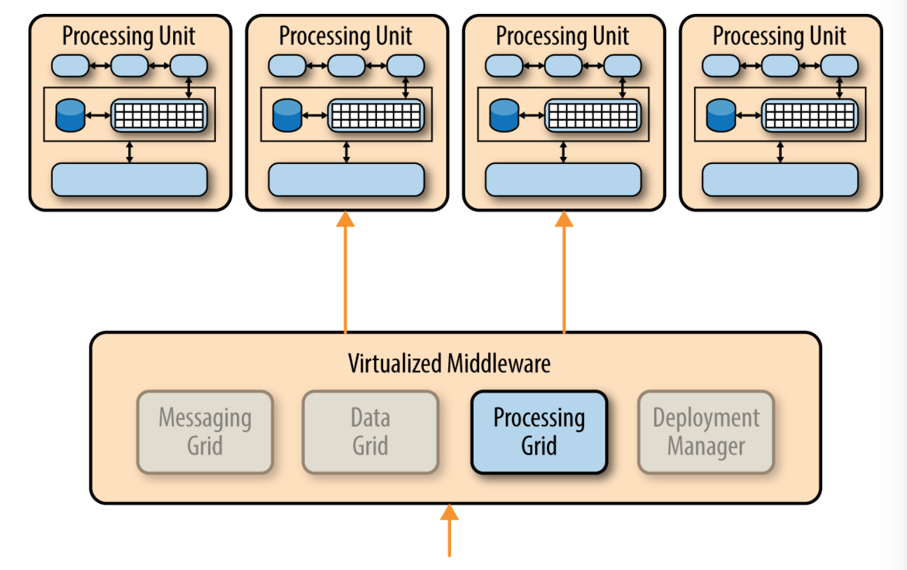

# 第五章 基于空间的架构

大多数基于网站的商务应用都遵循相同的请求流程：一个请求从浏览器发到web服务器，然后到应用服务器，然后到数据库服务器。虽然这个模式在用户数不大的时候工作良好，瓶颈会随着用户数量增加而出现，首先出现在web服务器层，然后应用服务器层，最后数据库服务器层。通常的解决办法就是**向外扩展**，也就是增加服务器数量。这个方法相对来说简单和廉价，并能够解决问题。然而，对于大多数高访问量的情况，它只不过是把web服务器的问题移到了应用服务器。而扩展应用服务器会更复杂，而且成本更高，并且又只是把问题移动到了数据库服务器，那会更复杂，更贵。就算你能扩展数据库服务器，你最终会陷入一个金字塔式的情形，在金字塔最下面是web服务器，它会出现最多的问题，但也最好伸缩。金字塔顶部是数据库服务器，问题不多，但最难伸缩。

在一个高并发大容量的应用中，数据库通常是决定应用能够支持多少用户同时在线的关键因素。虽然各种缓存技术和数据库伸缩产品都在帮助解决这个问题，但数据库难以伸缩的现实并没有改变。

基于空间的架构模型是专门为了**解决伸缩性和并行问题**而设计的。它对于用户数量不可预测且数量级经常变化的情况同样适用。在架构级别来解决这个伸缩性问题通常是比增加服务器数量或者提高缓存技术更好的解决办法。

## 模型介绍

基于空间的模型（有时也称为云架构模型）旨在减少限制应用伸缩的因素。模型的名字来源于分布式共享内存中的 tuple space（数组空间）概念。高伸缩性是通过去除中心数据库的限制，并使用从内存中复制的数据框架来获得的。保存在内存的应用数据被复制给所有运行的进程。进程可以动态的随着用户数量增减而启动或结束，以此来解决伸缩性问题。这样因为没有了中心数据库，数据库瓶颈就此解决，此后可以近乎无限制的扩展了。

大多数使用这个模型的应用都是标准的网站，它们接受来自浏览器的请求并进行相关操作。竞价拍卖网站是一个很好的例子 ( 12306更是一个典型的示例 )。网站不停的接受来自浏览器的报价。应用收到对某一商品的报价，记录下报价和时间，并且更新对该商品的报价，将信息返回给浏览器。

这个架构中有两个主要的模块：**处理单元** 和 **虚拟化中间件**。下图展示了这个架构河里面的主要模块。

处理单元包含了应用模块（或者部分的应用模块）。具体来说就是包含了web组件以及后台业务逻辑。处理单元的内容根据应用的类型而异——小型的web应用可能会部署到单一的处理单元，而大型一些的应用会将应用的不同功能模块部署到不同的处理单元中。典型的处理单元包括应用模块，以及保存在内存的数据框架和为应用失败时准备的异步数据持久化模块。它还包括复制引擎，使得虚拟化中间件可以将处理单元修改的数据复制到其他活动的处理单元。

虚拟化中间件负责保护自身以及通信。它包含用于数据同步和处理请求的模块，以及通信框架，数据框架，处理框架和部署管理器。这些在下文中即将介绍的部分，可以自定义编写或者购买第三方产品来实现。

## 模型间合作

基于空间的架构的魔力就在虚拟化中间件，以及各个处理单元中的内存中数据框架。下图展示了包含着应用模块、内存中数据框架、处理异步数据恢复的组件和复制引擎的处理单元架构。

虚拟化中间件本质上是架构的控制器，它管理请求，会话，数据复制，分布式的请求处理和处理单元的部署。虚拟化中间件有四个架构组件：通信框架，数据框架，处理框架和部署管理器。

### 通信框架

通信框架管理输入请求和会话信息。当有请求进入虚拟化中间件，通信框架就决定有哪个处理单元可用，并将请求传递给这个处理单元。通信框架的复杂程度可以从简单的round robin算法到更复杂的用于监控哪个请求正在被哪个处理单元处理的next-available算法。

### 数据框架

数据框架可能是这个架构中最重要和关键的组件。它与各个处理单元的数据复制引擎交互，在数据更新时来管理数据复制功能。由于通信框架可以将请求传递给任何可用的处理单元，所以每个处理单元包含完全一样的内存中数据就很关键。下图展示处理单元间如何同步数据复制，实际中是通过非常迅速的并行的异步复制来完成的，通常在微秒级。

### 处理框架

处理框架，就像下图所示，是虚拟化中间件中一个可选组件，负责管理在有多个处理单元时的分布式请求处理，每个处理单元可能只负责应用中的某个特定功能。如果请求需要处理单元间合作（比如，一个订单处理单元和顾客处理单元），此时处理框架就充当处理单元见数据传递的媒介。

### 部署管理器

部署管理器根据负载情况管理处理单元的动态启动和关闭。它吃鱼检测请求所需时间和在线用户量，在负载增加时启动新的处理单元，在负载下降时关闭处理单元。它是实现可变伸缩性需求的关键。

## 其他考虑

基于空间的架构是一个复杂和实现起来相对昂贵的框架。对于有可变伸缩性需求的小型web应用是很好的选择，然而，对于拥有大量草错的传统大规模关系型数据库应用，并不那么适用。

虽然基于空间的架构模型不需要集中式的数据储存，但通常还是需要这样一个，来进行初始化内存中数据框架，和异步的更新各处理单元的数据。通常也会创建一个单独的分区，来从隔离常用的断电就消失的数据和不常用的数据，这样减少处理单元之间对对方内存数据的依赖。

值得注意的是，虽然这个架构的另一个名字是云架构，处理单元（以及虚拟化中间件）都没有放在云端服务或者PaaS上。他们同样可以简单的放在本地服务器，这也是为什么我更倾向叫它“基于空间的架构”。

从产品实现的角度讲，这个架构中的很多组件都可以从第三方获得，比如GemFire, JavaSpaces, GigaSpaces，IBM Object Grid，nCache，和 Oracle Coherence。由于架构的实现根据工程的预算和需求而异，所以作为架构师，你应该在实现或选购第三方产品前首先明确你的目标和需求。

## 架构分析

下面的表格是这个架构的特征分析和评分。每个特征的评分是基于一个典型的架构实现来给出的。要知道这个模式相对别的模式的对比，请参见最后的附录A。

#### 综合能力

评分：高

分析：综合能力是对环境变化做出快速反应的能力。因为处理单元（应用的部署实例）可以快速的启动和关闭，整个应用可以根据用户量和负载做出反应。使用这个架构通常在应对代码变化上，由于较小的应用规模和组件间相互依赖，也会反映良好。

#### 部署难易程度

评分：高

分析：虽然基于空间的架构通常没有解耦合并且功能分布，但他们是动态的，也是成熟的基于云的工具，允许应用轻松的部署到服务器。

#### 可测试性

评分：低

分析：测试高用户负载及昂贵又耗时，所以在测试架构的可伸缩性方面很困难

#### 性能

评分：高

分析：通过内存中数据存取和架构中的缓存机制可获得高性能

#### 伸缩性

评分：高

分析：高伸缩性是源于几乎不依赖集中式的数据库，从而去除了这个限制伸缩性的瓶颈。

#### 开发难度

评分：低

分析：成熟的缓存机制和内存中数据框架是的这个价格相对难以开发，主要是因为难以熟悉这个架构开发所需要的工具和第三方产品。而且，开发过程中还需要特别注意源码不要对性能和可伸缩性造成不良影响。
